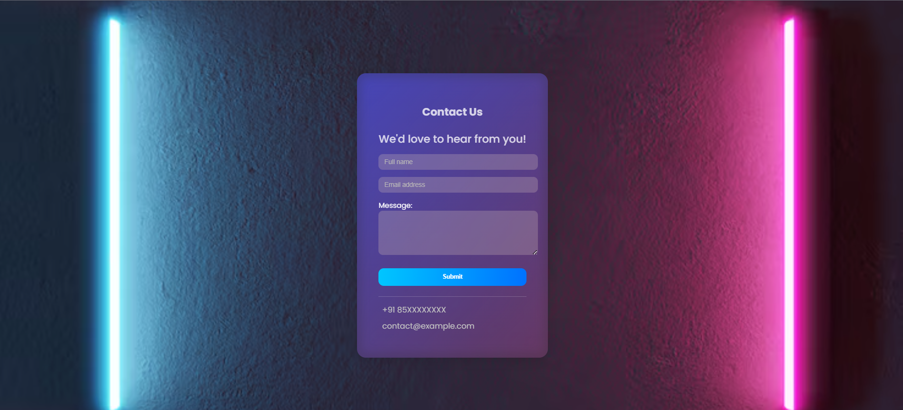

# 📬 Contact Form Webpage

A modern, responsive contact form built with **HTML**, **CSS**, and **JavaScript** featuring form validation, glassmorphism UI, and interactive animations. Easily customizable for any personal or business website.

>

## 🚀 Features

- 🌐 Fully responsive design
- 🎨 Beautiful glassmorphism UI
- ✅ Client-side form validation
- 🧠 Real-time error message clearing
- 💡 Interactive UI effects on hover
- 📱 Mobile-first approach

---

## 🛠️ Technologies Used

- **HTML5** – Semantic structure
- **CSS3** – Custom styles, media queries, animations
- **JavaScript (Vanilla)** – Input validation and interaction logic
- **Google Fonts** – Poppins for typography
- **Font Awesome** – Icons (optional)

---

## 📂 Folder Structure

```
contact-form/
│
├── index.html #Main HTML structure
├── style.css # All styling and responsiveness
├── script.js # Form validation logic
└── README.md # Project overview
```

---

## 📸 Preview

> 💡 Try it live by opening `index.html` in your browser or deploying via GitHub Pages.

---

## 📥 Getting Started

To run this project locally:

1. **Clone the repository:**

```bash
git clone https://github.com/your-username/contact-form-webpage.git
```
2. **Navigate into the project directory:**
```
cd contact-form-webpage
```
3. **Open the index.html file in your browser:**

```
open index.html     # Mac
start index.html    # Windows
xdg-open index.html # Linux
```
---
## 🧪 Validation Logic
- Implemented via JavaScript:

- Name is required.

- Email must be valid (regex).

- Message should not be empty.

- If validation passes, a success message appears and the form resets.
---

#### 🙏 Acknowledgements

- This Contact Form was crafted with attention to clean aesthetics, user-friendly validation, and responsive design.  

- It reflects my passion for modern UI trends like glassmorphism and smooth form interactions. 

- Each line of code—from layout to hover effects—was written with care to enhance usability and visual appeal.  

- This project is both a creative showcase and a milestone in my frontend development journey.

## 📧 Contact
Made with ❤️ by Rishabh

[LinkedIn](https://www.linkedin.com/in/rishabh-dtu27/) | [GitHub](https://github.com/RishabhMunakhiya)

